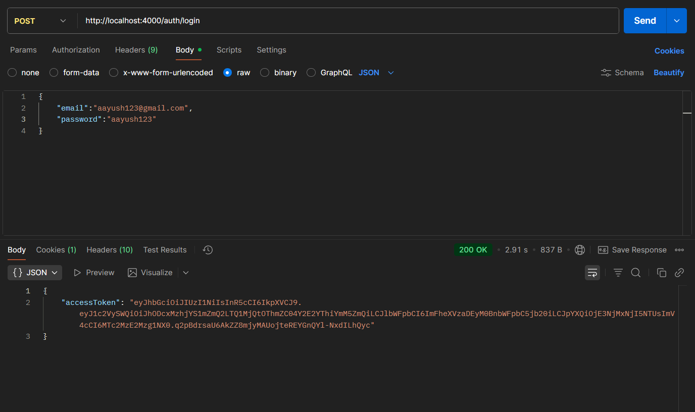
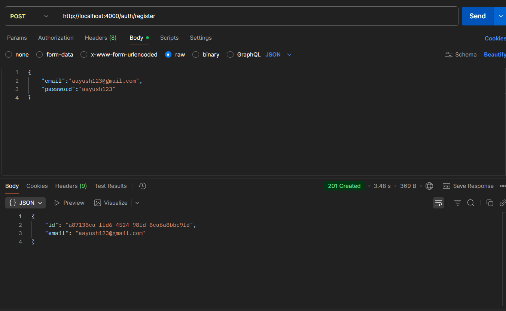
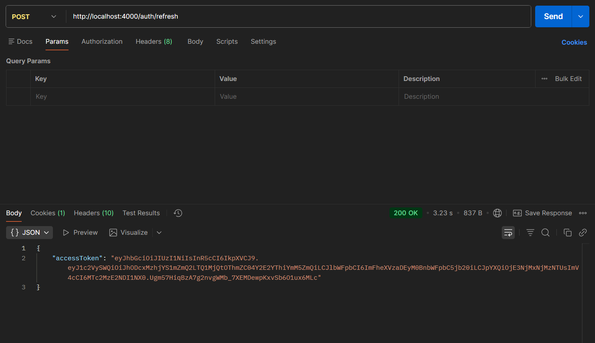
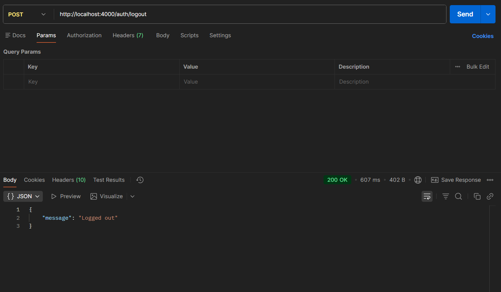
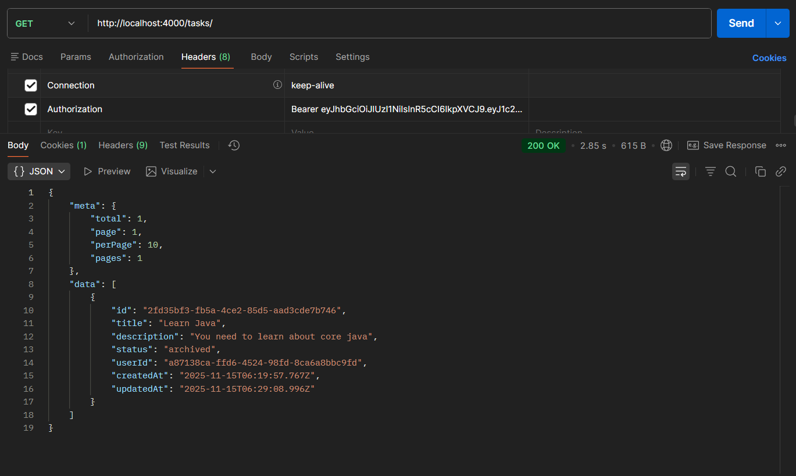
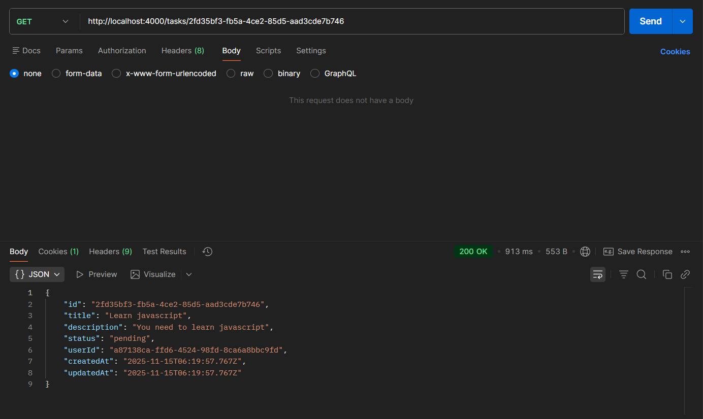
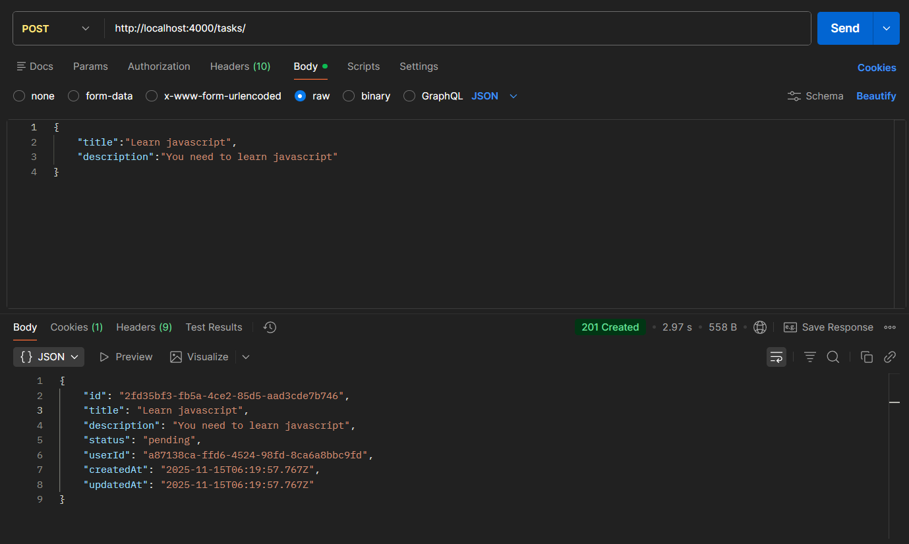
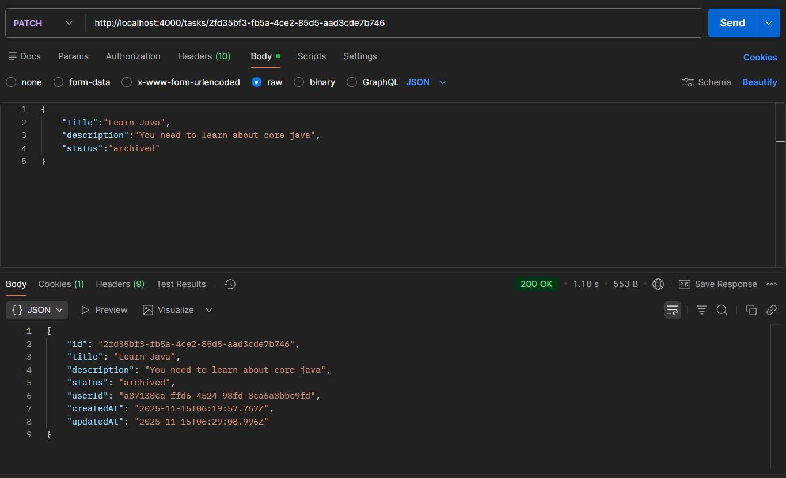
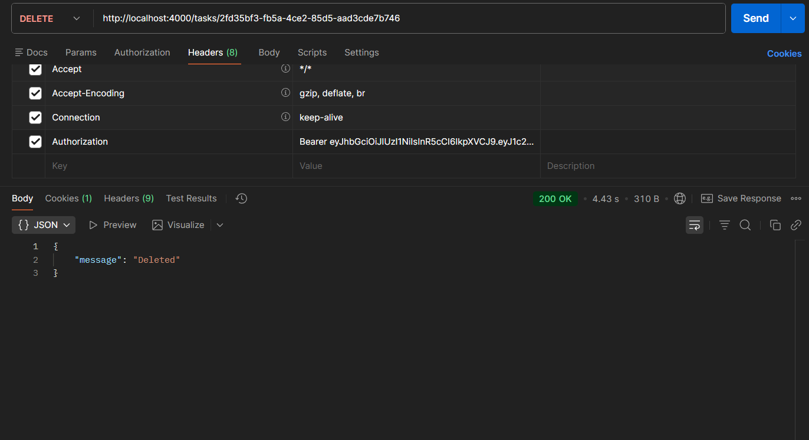
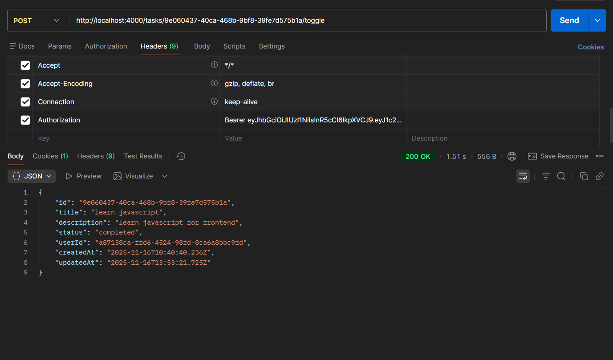

# Backend (Node.js + TypeScript + Prisma + JWT)

## Overview

This backend provides user authentication (JWT access + refresh tokens), task management with full CRUD, pagination, search, filtering, and secure ORM-based database operations using **Prisma**.

---

## Features

- **Authentication**

  - Register, Login, Logout
  - Access Token + Refresh Token (httpOnly cookie)
  - Bcrypt password hashing

- **Task Management**

  - Create, Read, Update, Delete tasks
  - Toggle task status
  - Pagination, Search, Filtering

- 🗄️ **Database**

  - Prisma ORM
  - SQL Database (SQLite/Postgres)

- ⚙️ **Tech Stack**
  - Node.js
  - TypeScript
  - Express.js
  - Prisma ORM
  - Zod Validation

---

## API Routes

### Auth Routes

```
/auth/register
/auth/login
/auth/refresh
/auth/logout
```

### Task Routes

```
/tasks (GET, POST)
/tasks/:id (GET, PATCH, DELETE)
/tasks/:id/toggle (POST)
```

---

## 📸 API Routes Screenshot

### Route: POST /auth/login



### Route: POST /auth/register



### Route: POST /auth/refresh



### Route: POST /auth/logout



### Route: GET /tasks



### Route: GET /tasks/:id



### Route: POST /tasks



### Route: PATCH /tasks/:id



### Route: DELETE /tasks/:id



### Route: POST /tasks/:id/toggle



---

## Setup & Installation

### 1. Install dependencies

```bash
npm install
```

### 2. Setup Environment

Create `.env`:

```
DATABASE_URL="file:./dev.db"
ACCESS_TOKEN_SECRET="your_secret"
REFRESH_TOKEN_SECRET="your_refresh_secret"
ACCESS_TOKEN_EXPIRES_IN="your_access_expire"
REFRESH_TOKEN_EXPIRES_IN="your_refresh_expire"
PORT="port_number"
NODE_ENV="production || development"
FRONTEND_URL=http://localhost:3000
```

### 3. Run Prisma migrations

```bash
npx prisma migrate dev --name init
```

### 4. Run the Server

```bash
npm run dev
```

---

## Project Structure

```
src/
 ├─ routes/
 ├─ controllers/
 ├─ middlewares/
 ├─ validators/
 ├─ utils/
 ├─ prismaClient.ts
 └─ app.ts
```

---

## Notes

- Refresh token is stored **server-side** to prevent token reuse.
- Access token stored **in-memory on frontend** for security.
- CORS configured for secure cookie handling.

---

## License

MIT
